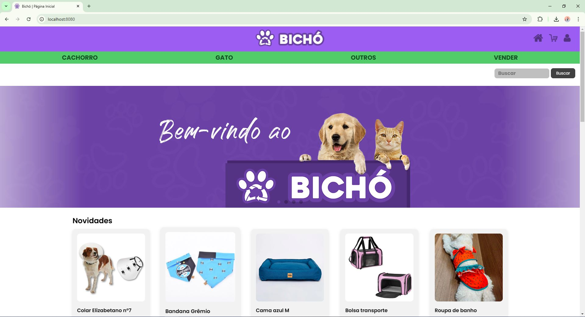
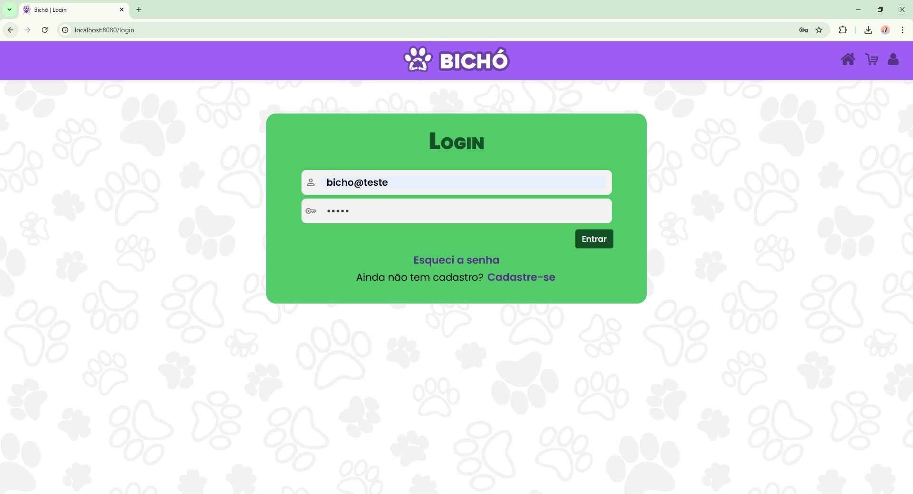
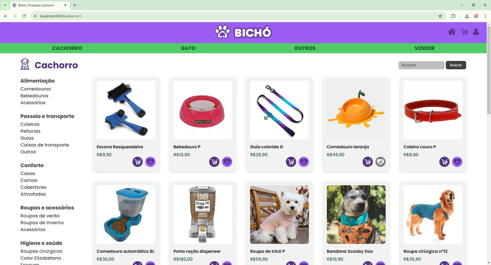
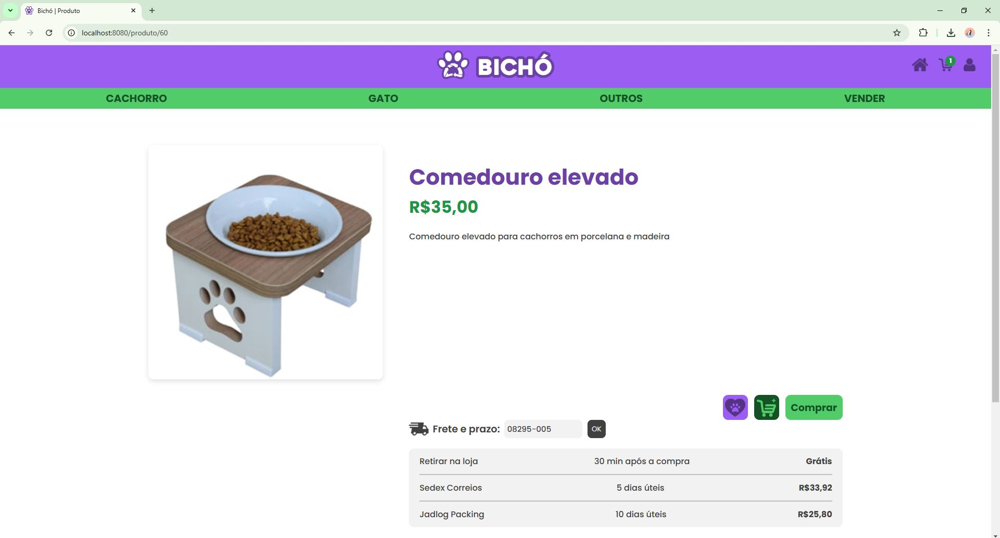
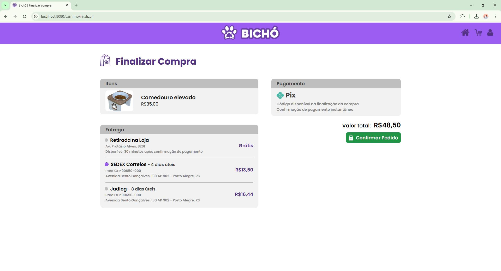
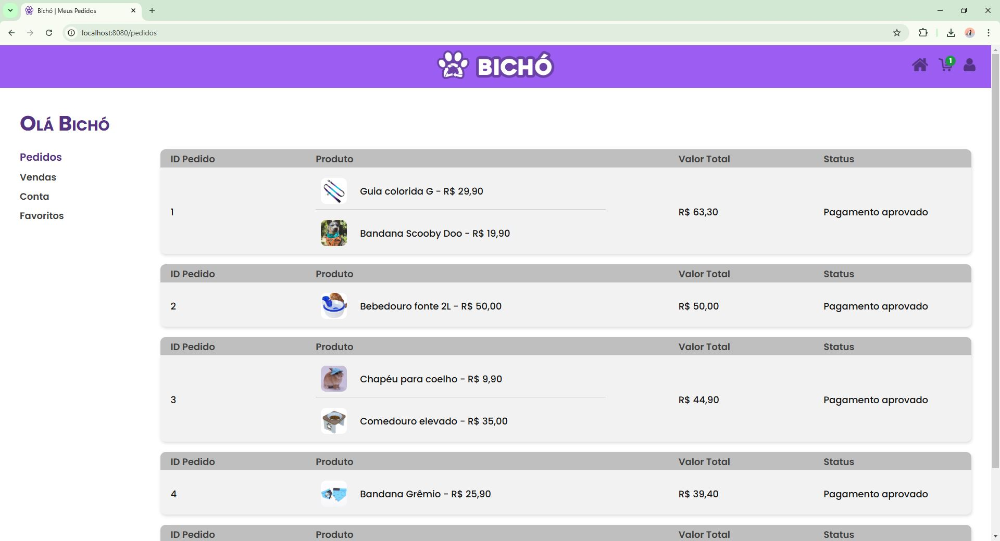

[HTML_BADGE]: https://img.shields.io/badge/html5-%23E34F26.svg?style=for-the-badge&logo=html5&logoColor=white
[CSS_BADGE]: https://img.shields.io/badge/css3-%231572B6.svg?style=for-the-badge&logo=css3&logoColor=white
[JAVASCRIPT_BADGE]: https://img.shields.io/badge/javascript-%23323330.svg?style=for-the-badge&logo=javascript&logoColor=%23F7DF1E
[JAVA_BADGE]: https://img.shields.io/badge/java-%23ED8B00.svg?style=for-the-badge&logo=openjdk&logoColor=white
[SPRING_BADGE]: https://img.shields.io/badge/spring-%236DB33F.svg?style=for-the-badge&logo=spring&logoColor=white
[SQL_BADGE]: https://img.shields.io/badge/mysql-4479A1.svg?style=for-the-badge&logo=mysql&logoColor=white

<h1 align="center" style="font-weight: bold;"> 🐶🐹 Projeto Bichó 🐱🐤</h1>

🌐 <a href="#ingles"> _English README</a> below the portuguese_

![HTML_BADGE]
![CSS_BADGE]
![JAVASCRIPT_BADGE]
![JAVA_BADGE]
![SPRING_BADGE]
![SQL_BADGE]

<p align="center">
  <a href="#sobre">Sobre</a> • 
  <a href="#comecando">Começando</a>
</p>

<p align="center">
  
  
  
  
  
  
</p>

<h2 id="sobre">📖 Sobre</h2>

Nesse projeto foi criada uma aplicação web para compra e venda de itens pet usados, na qual os usuários podem fazer seu cadastro, fazer login, navegar por produtos organizados por categorias e subcategorias, adicionar e remover produtos do carrinho, calcular tempo e valor de frete de acordo com CEP e simular o processo de compra como um e-commerce real, a fim de promover o consumo consciente e a sustentabilidade.

<h4>🔒 Importante!</h4>
Nenhum dado inserido na aplicação fica salvo em nuvem. É completamente seguro inserir dados reais ou fictícios no site.

<h4>📚 Estudo</h4>
Esse projeto é uma aplicação para meu Trabalho de Conclusão de Curso (TCC) através do estudo de desenvolvimento web.

<h2 id="comecando">🚀 Começando</h2>

Para testar o projeto em sua máquina, é necessário seguir os passos abaixo:

<h3>Pré-requisitos</h3>

- [Eclipse](https://eclipseide.org/) (2024-09 ou superior ou outra IDE Java de sua preferência)
- [MySQL Workbench](https://dev.mysql.com/downloads/workbench/) (ou outra ferramenta de banco de dados MySQL)

<h3>Clonando</h3>

Como clonar

```bash
git clone https://github.com/brunaciarlo/Bicho.git
```
Exporte o script database_bicho.sql presente na pasta clonada para seu banco de dados

Inicie a IDE Java (nesse exemplo usaremos o Eclipse)

Selecione `File >> Import >> Maven >> Maven >> Existing Maven Projects` e selecione a pasta clonada ` >> Finish`

Após o projeto carregar completamente, entre no arquivo `src/main/java >> projeto.bicho >> BichoApplication.java` e rode a aplicação.

Na base de dados importada já tem um cadastro teste cujo usuário (e-mail) é bicho@teste e a senha é "teste", mas você pode criar um cadastro com os dados que desejar*

*Esses dados estarão armazenados apenas em sua máquina

---------------------------------------------------------------------------------------------------------------------------------------

<h1 id="ingles" align="center" style="font-weight: bold;">🐶🐹 Bichó Project 🐱🐤</h1>

![HTML_BADGE]
![CSS_BADGE]
![JAVASCRIPT_BADGE]
![JAVA_BADGE]
![SPRING_BADGE]
![SQL_BADGE]

<p align="center">
  <a href="#about">About</a> • 
  <a href="#starting">Getting Started</a>
</p>

<p align="center">
  
  
  
  
  
  
</p>

<h2 id="about">📖 About</h2>

In this project, a web application was developed for buying and selling used pet items, where users can register, log in, browse products organized by categories and subcategories. They can add and remove products from the cart, calculate shipping time and cost based on ZIP codes (Brazilians only), and simulate the purchase process like a real e-commerce platform, aiming to promote conscious consumption and sustainability.

<h4>🔒 Important!</h4>

No data entered into the application is stored in the cloud. It is completely safe to input real or fictional data on the website.

<h4>📚 Study</h4>

This project is an application developed for my Final Project as part of a study on web development.

<h2 id="starting">🚀 Getting Started</h2>

In case you want to test the application in your machine, follow the next steps:

<h3>Prerequisites</h3>

- [Eclipse](https://eclipseide.org/) (version 2024-09 or later, or any other Java IDE of your choice)
- [MySQL Workbench](https://dev.mysql.com/downloads/workbench/) (or any other MySQL database tool)

<h3>Cloning</h3>

How to clone

```bash
git clone https://github.com/brunaciarlo/Bicho.git
```

Export the database_bicho.sql script from the cloned folder to your database.

Start your Java IDE (in this example, we’ll use Eclipse).

Navigate to `File >> Import >> Maven >> Maven >> Existing Maven Projects` select the cloned folder, and click ` >> Finish`

Once the project is fully loaded, go to the file `src/main/java >> projeto.bicho >> BichoApplication.java` and run the application.

The imported database already contains a test user with the email bicho@teste and the password teste, but you can create a new account with any data you prefer*

*This data will only be stored locally on your machine.
